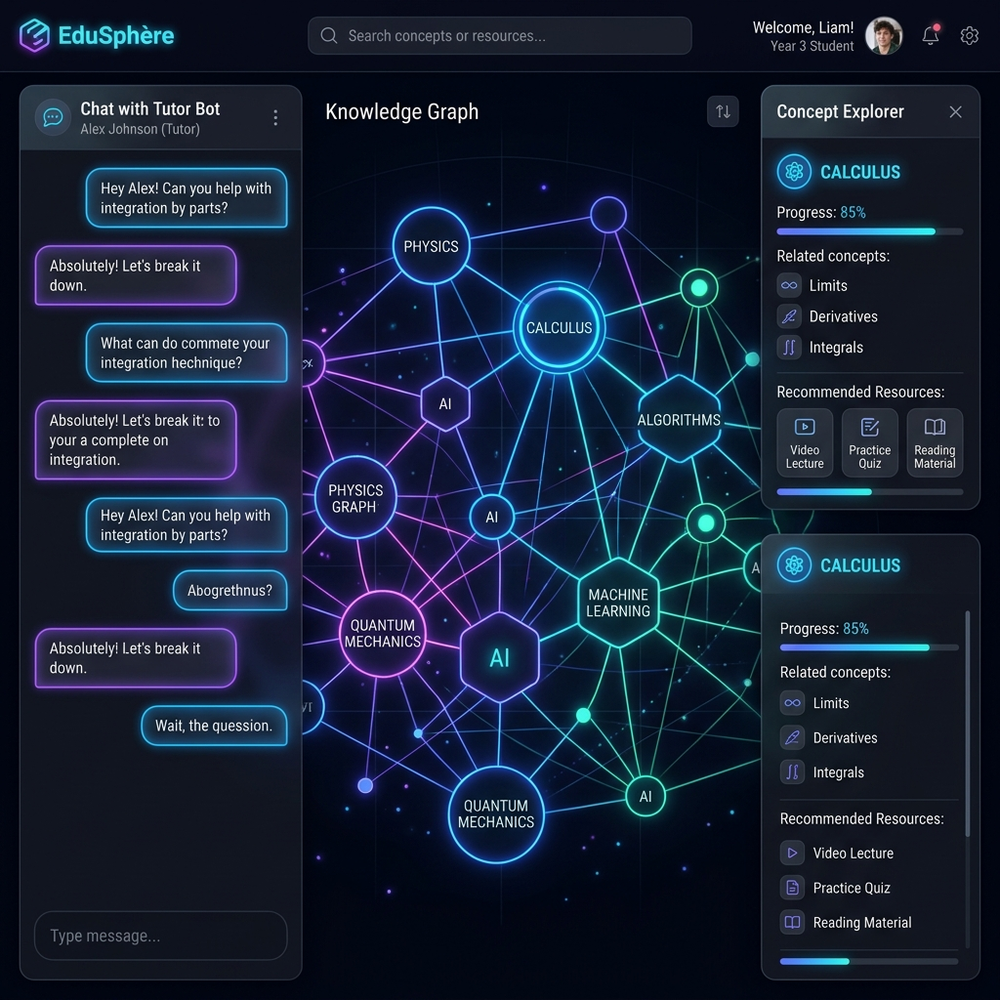
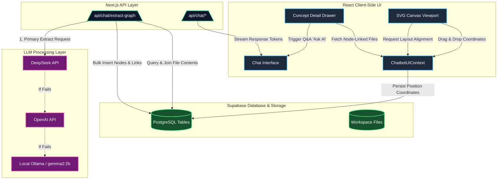
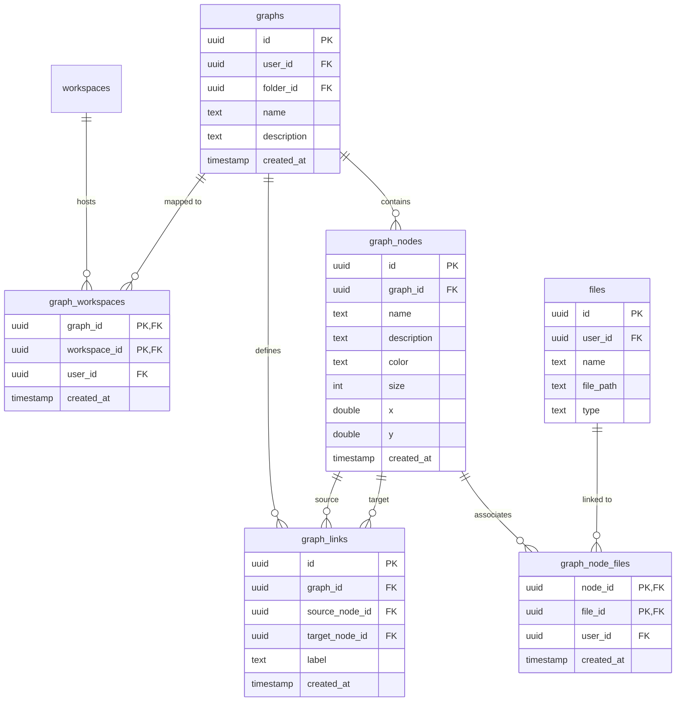

# EduSphère & Interactive Knowledge Graph

EduSphère is a premium, state-of-the-art visual extension built on top of the open-source **Chatbot UI** project. It transforms standard chat interfaces into interactive, spatial canvases where users can map out concepts, discover connections, attach workspace documents to specific topics, and dynamically generate concept maps from real-time conversations.



---

## Table of Contents
1. [Core Features](#1-core-features)
2. [System Architecture](#2-system-architecture)
3. [Directory & Project Structure](#3-directory--project-structure)
4. [Database Schema & Security](#4-database-schema--security)
5. [Technical Walkthroughs](#5-technical-walkthroughs)
   - [Physics-Based Auto-Layout (Align Graph)](#physics-based-auto-layout-align-graph)
   - [Auto-Concept Extraction & Resilient Fallback](#auto-concept-extraction--resilient-fallback)
   - [Real-Time Conversational Sync](#real-time-conversational-sync)
6. [Local Setup & Developer Quickstart](#6-local-setup--developer-quickstart)

---

## 1. Core Features

### 🎓 Interactive Concept Visualizer
* **SVG Canvas Viewport**: A zoomable ($0.5\times$ to $2.0\times$) and pannable SVG workspace with grid background lines, drag-and-drop coordinate persistence, and smooth glows matching HSL category colors.
* **Flexible Concept Management**: Click-to-select concept nodes, edit details, customize category coloring, and link nodes together using custom labels (e.g. *"requires"*, *"leads to"*, *"implements"*).
* **"Ask AI" Concept Q&A**: Bind documents (PDF, Markdown, TXT) uploaded in your workspace directly to any concept node. Click **"Ask AI"** to automatically load those files as chat context and start an AI Q&A focused on that specific concept.

### 🧠 Intelligent Concept Auto-Extraction
* **Doc-to-Graph Extraction**: Select one or more workspace documents, and let the NLP extraction pipeline automatically parse their content, identify key topics, map relationship vectors, and render them on your canvas.
* **Conversational Syncing**: When a graph is selected, active chat conversations automatically scan assistant responses and insert newly discussed concepts into the canvas in real-time.
* **Fail-Safe Processing Pipeline**: Extractor requests route via **DeepSeek** (optimized for speed/cost) ➡️ fallback to **OpenAI (GPT-4 Turbo)** ➡️ fallback to local **Ollama (`gemma2:2b`)** if cloud APIs are offline.

---

## 2. System Architecture

The following architecture diagram outlines how the client-side UI, serverless Next.js API routes, Supabase backend databases, and LLM providers interface with each other.



---

## 3. Directory & Project Structure

The project follows a Next.js App Router structure with localized routes, dynamic supabase connections, and clear component isolation:

```
├── app/                      # Next.js App Router folders
│   ├── [locale]/             # Localized routes (multilingual support)
│   │   ├── [workspaceid]/    # Workspace scoping
│   │   │   ├── chat/         # Active conversation page
│   │   │   └── layout.tsx    # Workspace navigation & frame
│   │   ├── setup/            # User onboarding & profile setup
│   │   └── login/            # User auth pages (login, registration)
│   ├── api/                  # Serverless endpoint handlers
│   │   └── chat/             # Chat routes & tool actions
│   │       ├── extract-graph/# AI NLP graph extractor endpoint
│   │       └── [provider]/   # Model provider routers (DeepSeek, OpenAI, etc.)
│   ├── auth/                 # OAuth / Supabase login callback handlers
│   └── middleware.ts         # Authentication & localization router middleware
├── components/               # React components directory
│   ├── chat/                 # Chat panel inputs, picker listings, helpers
│   ├── knowledge-graph/      # Canvas visualizer, math physics, and dialog forms
│   ├── messages/             # Message bubbles, codeblocks, formatting
│   ├── models/               # Model selection selectors & icons
│   ├── sidebar/              # Workspace navigation toggles & list elements
│   ├── ui/                   # Reusable shadcn base elements
│   └── utility/              # Command palette, draw sheets, translation providers
├── db/                       # Database wrappers interacting with Supabase client
│   ├── chats.ts              # Chats management
│   ├── files.ts              # File upload descriptors
│   ├── knowledge-graphs.ts   # Graph nodes, edges, file maps CRUD operations
│   └── messages.ts           # Message entries
├── lib/                      # Helper utilities, custom hooks, lists
│   ├── hooks/                # Keyboard inputs, clipboard hooks
│   ├── models/               # Pricing lists, config settings, provider arrays
│   ├── server/               # Auth helpers & profile settings
│   └── supabase/             # Client, browser, and middleware SSR instances
├── supabase/                 # Supabase configuration & migrations
│   ├── migrations/           # Database schemas versioned SQL history
│   └── seed.sql              # Seed data for testing profiles
├── types/                    # TypeScript interfaces & declarations
└── public/                   # Public asset folders (icons, localizations)
```

---

## 4. Database Schema & Security

EduSphère stores concept nodes, links, and file associations using PostgreSQL. High-level relationships are shown in the Entity-Relationship diagram below:



### 🔒 Row-Level Security (RLS) policies
All tables have RLS enabled to prevent cross-tenant access:
* **`graphs`**: Read/write policies restricted via `user_id = auth.uid()`.
* **`graph_nodes` & `graph_links`**: Access checked dynamically by verifying if the parent `graph_id` is linked to a record in `graphs` belonging to `auth.uid()`.
* **`graph_node_files`**: Mapped links restricted by verification against the creating user's ID.

---

## 5. Technical Walkthroughs

### Physics-Based Auto-Layout (Align Graph)

The concept map's layout engine uses a customized **Force-Directed Spring Simulation** to organize messy node meshes. Clicking **"Align Graph"** triggers 80 iterations of a physical simulation directly on the nodes:

1. **Coulomb's Law (Repulsion Force)**: Every node repels other nodes to prevent overlap.
   $$F_{repel} = \frac{k_{repel}}{d^2} \quad \text{where } k_{repel} = 2500, \ d = \text{distance}$$
2. **Hooke's Law (Spring Attraction Force)**: Connected nodes are pulled closer together.
   $$F_{attract} = k_{attract} \times (d - d_{target}) \quad \text{where } k_{attract} = 0.05, \ d_{target} = 120$$
3. **Gravity Force**: Pulls all nodes slightly toward the layout center to avoid canvas drifting.
4. **Coordinate Saving**: The positions $(x, y)$ calculated at the final step are written back to the database in bulk using parallel queries to `updateGraphNode`.

---

### Auto-Concept Extraction & Resilient Fallback

When documents are passed to the `/api/chat/extract-graph` API, a serverless request orchestrates the extraction process:

```
[Extract Call] ──> Read file_items content ──> Generate Prompts 
                     │
                     ▼
             [1. DeepSeek API] ──(Success)──> Parse JSON ──> DB Insert
                     │
                 (Fails / Offline)
                     ▼
             [2. OpenAI API] ──(Success)──> Parse JSON ──> DB Insert
                     │
                 (Fails / Offline)
                     ▼
             [3. Local Ollama] ──(Success)──> Parse JSON ──> DB Insert
```

* **Prompt Engineering**: The LLM receives strict instructions to parse the text and structure output *only* as a specified JSON object format detailing nodes and edges.
* **JSON Filtering**: To ensure robustness against conversational fluff, the API filters the response content, extracting substring JSON structures starting from the first `{` and ending at the last `}` before running the parser.

---

### Real-Time Conversational Sync

When a user is actively chatting with an assistant while a Knowledge Graph is open in their workspace:

1. The client-side hook [use-chat-handler.tsx](file:///Users/akhileshyerram/chatbot-ui/components/chat/chat-hooks/use-chat-handler.tsx) processes the request.
2. Once the final token of the assistant's response is received, the client detects if `selectedGraph` is active.
3. It triggers a background POST request to `/api/chat/extract-graph` sending the text of the assistant's answer.
4. The backend LLM extracts newly introduced concepts from the response, links them to parent nodes, and saves them to PostgreSQL.
5. The client triggers a state reload (`getGraphDetails`), and the concept canvas updates on-the-fly, allowing the map to grow dynamically with the chat.

---

## 6. Local Setup & Developer Quickstart

To run the application locally:

### 1. Prerequisites
Ensure you have [Docker](https://www.docker.com/) and [Node.js (v18+)](https://nodejs.org/) installed.

### 2. Setup Database & Packages
```bash
# Install dependencies
npm install

# Start local Supabase Docker containers
supabase start

# Apply migrations to prepare schemas
npm run db-migrate
```

### 3. Setup Ollama (Local LLM Fallback)
Install [Ollama](https://ollama.com) and pull the gemma2:2b model:
```bash
ollama pull gemma2:2b
```

### 4. Run Development Server
```bash
# Populate environment variables
cp .env.local.example .env.local

# Run Dev Server (starts Supabase & Next.js concurrently)
npm run chat
```

Open [http://localhost:3000](http://localhost:3000) and sign in using the default Supabase test profile:
- **Email**: `test@test.com`
- **Password**: `password`
