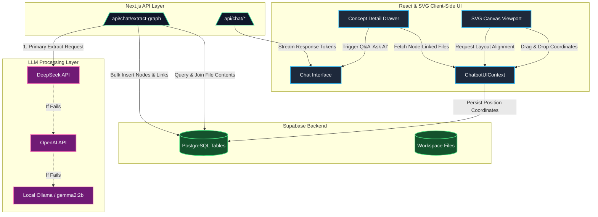
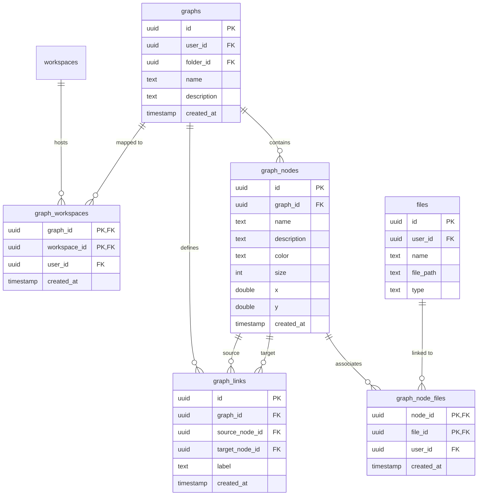

# EduSphère: Interactive Knowledge Canvas & AI Chat Workspace

EduSphère is a premium, state-of-the-art extension built on top of the open-source **Chatbot UI** project. It transforms standard linear chat interfaces into a dynamic, spatial workspace. Users can map out concepts, discover hidden connections, bind workspace documents directly to specific topics, and dynamically generate interactive knowledge graphs from real-time conversations.


---

## 🚀 Key Capabilities

### 🗺️ Interactive Concept Canvas
* **Precision Viewport**: A highly responsive, zoomable ($0.5\times$ to $2.0\times$) and pannable SVG workspace equipped with custom grid line backgrounds, drag-and-drop node positioning, and smooth glowing indicators.
* **Semantic Relationships**: Edit nodes, customize color themes, and connect concepts using custom link labels (e.g., *“requires”*, *“implements”*, *“extends”*).
* **Context-Bound Q&A (“Ask AI”)**: Attach workspace files (PDFs, Markdown, text files) directly to any canvas node. Clicking **“Ask AI”** feeds those targeted documents straight into the chat context for node-specific queries.

### 🧠 Intelligent Concept Auto-Extraction
* **Doc-to-Graph Parsing**: Feed documents into the NLP extraction pipeline to automatically isolate core terms, construct relationship links, and map them to the canvas.
* **Conversational Sync**: The canvas scans assistant responses in real-time, instantly extracting and rendering new concept nodes as the conversation unfolds.
* **Resilient Multi-LLM Fallback**: Extraction requests flow through a high-availability pipeline: **DeepSeek** (primary) ➡️ **OpenAI GPT-4 Turbo** (secondary) ➡️ Local **Ollama (`gemma2:2b`)** (local fallback).

---

## 🏗️ System Architecture

The following diagram illustrates the interaction flow between the client interface, Serverless Next.js API endpoints, Supabase database layers, and LLM providers.



---

## 📁 Repository Structure

```
├── app/                      # Next.js App Router
│   ├── [locale]/             # Multi-language translations & routing
│   │   ├── [workspaceid]/    # Workspace navigation boundaries
│   │   │   ├── chat/         # Live chat interfaces
│   │   │   └── layout.tsx    # Layout framing & navigation
│   │   ├── setup/            # User onboarding flows
│   │   └── login/            # Authentication interface
│   ├── api/                  # Backend API routes
│   │   └── chat/             # Chat endpoints & graph extraction
│   │       ├── extract-graph/# Auto-concept extraction engine
│   │       └── [provider]/   # Router configurations for LLM providers
│   ├── auth/                 # Supabase session handlers
│   └── middleware.ts         # Internationalization & session middleware
├── components/               # React UI Components
│   ├── chat/                 # Chat interface panels & prompt inputs
│   ├── knowledge-graph/      # Interactive SVG canvas & physical layout logic
│   ├── messages/             # Markdown & code block formatting
│   ├── models/               # Model selector dropdowns
│   ├── sidebar/              # Workspace sidebar & navigation list items
│   ├── ui/                   # Reusable base elements (shadcn/radix)
│   └── utility/              # Command palette, sheets, and drawers
├── db/                       # Database clients & query definitions
│   ├── chats.ts              # Chat metadata CRUD operations
│   ├── files.ts              # File metadata & document linking
│   ├── knowledge-graphs.ts   # Graph structure (nodes, edges, node-files) queries
│   └── messages.ts           # Chat histories & system prompts
├── lib/                      # Core helpers & config models
│   ├── hooks/                # User input and session hooks
│   ├── models/               # Config defaults & provider metadata
│   ├── server/               # Auth helpers & profile settings
│   └── supabase/             # Supabase clients (browser, server, middleware SSR)
└── supabase/                 # Supabase configuration & migrations
```

---

## 💾 Database Schema & Security

EduSphère relies on structured tables in PostgreSQL to manage and connect concepts, files, and user workspaces.



### 🔒 Row-Level Security (RLS) Policies
PostgreSQL Row-Level Security ensures strong tenant isolation across all user data:
* **`graphs`**: Read/write access is restricted exclusively to the graph owner: `user_id = auth.uid()`.
* **`graph_nodes` & `graph_links`**: Access is authorized by joining the parent graph and verifying `user_id = auth.uid()`.
* **`graph_node_files`**: Junction mapping permissions are verified against the active user's credentials.

---

## ⚙️ Core Technical Logic

### 1. Physics-Based Auto-Layout
When a layout is cluttered, clicking **"Align Graph"** initiates an 80-iteration **Force-Directed Spring Simulation** calculated in client-side memory:

1. **Coulomb's Law (Node Repulsion)**: Spreads nodes apart to resolve overlaps.
   $$F_{\text{repel}} = \frac{k_{\text{repel}}}{d^2} \quad \text{where } k_{\text{repel}} = 2500, \ d = \text{distance}$$
2. **Hooke's Law (Link Attraction)**: Pulls connected nodes toward a natural distance.
   $$F_{\text{attract}} = k_{\text{attract}} \times (d - d_{\text{target}}) \quad \text{where } k_{\text{attract}} = 0.05, \ d_{\text{target}} = 120$$
3. **Central Gravity**: Prevents disconnected nodes from floating off the screen boundaries.
4. **State Persistence**: The calculated coordinates $(x, y)$ are saved back to Supabase in a batch write.

### 2. Conversational Syncing
When a user chats with the AI assistant on an active workspace:
1. The [use-chat-handler.tsx](file:///Users/akhileshyerram/chatbot-ui/components/chat/chat-hooks/use-chat-handler.tsx) hook captures the completed message streams.
2. The client routes the assistant's response to `/api/chat/extract-graph`.
3. The LLM extracts newly introduced concepts, returns them as clean JSON structures, and automatically generates new nodes and edges on the current canvas.

---

## 🛠️ Local Development Quickstart

Follow these steps to run the workspace server locally:

### 1. Prerequisite Installations
* **Node.js**: Version 18 or higher.
* **Docker**: Required for running the local Supabase container environment.
* **Ollama**: (Optional) For offline local LLM capability.

### 2. Install Packages & Database Setup
```bash
# Install dependencies
npm install

# Start local Supabase container infrastructure
supabase start

# Migrate schema tables
npm run db-migrate
```

### 3. Setup Ollama (Local Extractor Fallback)
Download and launch [Ollama](https://ollama.com), then pull the target model:
```bash
ollama pull gemma2:2b
```

### 4. Run Workspace Server
```bash
# Create local configuration variables
cp .env.local.example .env.local

# Launch the Next.js app and the local database concurrently
npm run chat
```

Once running, navigate to [http://localhost:3000](http://localhost:3000) and authenticate using the default credentials:
* **Email**: `test@test.com`
* **Password**: `password`
